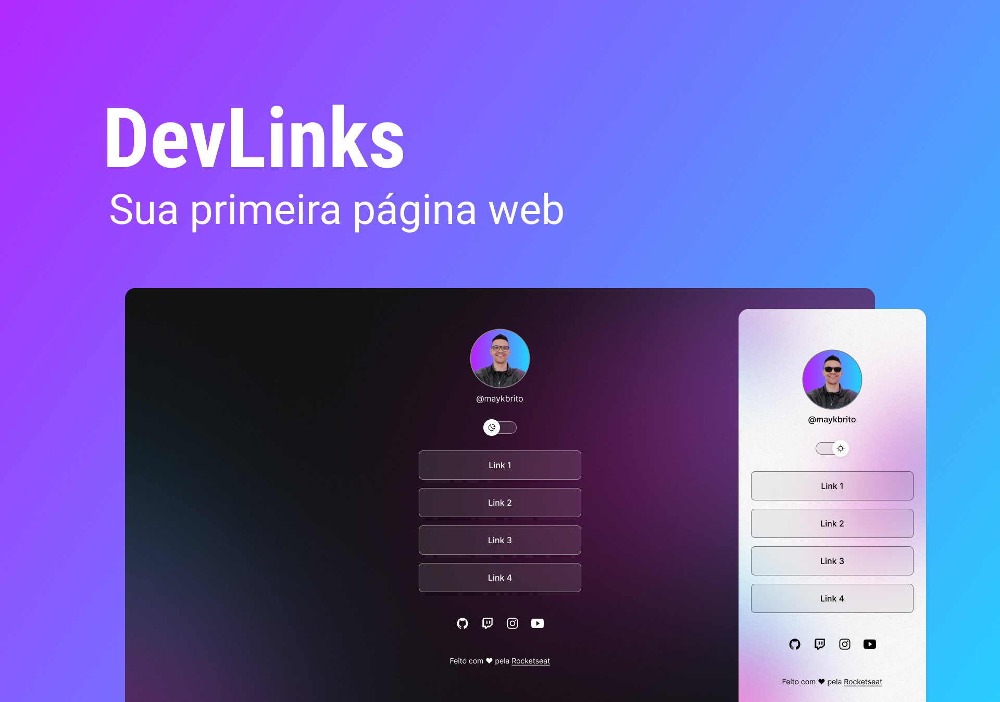

<h1 align="center">Discover</h1>

    

## Tecnolgias🚀

- HTML e CSS
- JavaScript
- Git e GitHub
- Figma

## Projeto💻

O DevLinks é um agregador de links para usar como cartão de vistas online.

## Layout🏷️

Você pode visualizar o layout do projeto através [DESSE LINK] (https://www.figma.com/file/DWDNOuQa7uX3LXA1Z5wP75/DevLinks-(Community)?type=design&node-id=0-1&mode=design&t=cTdKLs8rIVSFtd6f-0). É necessário ter conta [Figma] (https://figma.com) para acessá-lo.

